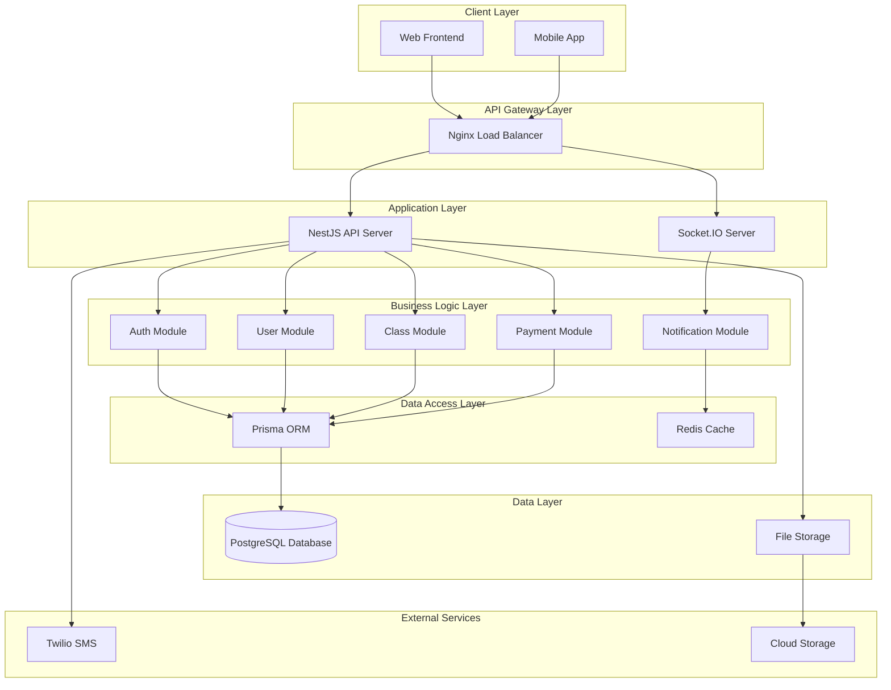
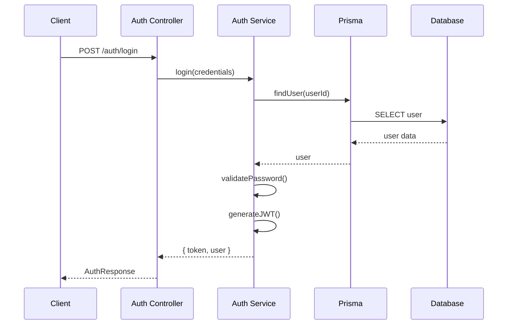
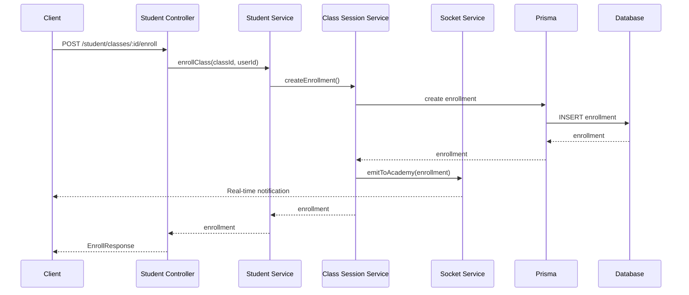
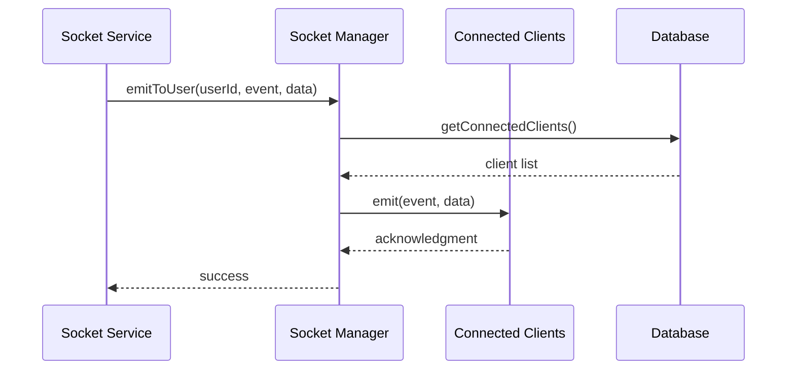

# 🏗️ 아키텍처 설계 문서

Team Elliot 백엔드 프로젝트의 아키텍처 설계 및 구조를 설명합니다.

## 📋 목차

- [아키텍처 개요](#-아키텍처-개요)
- [시스템 아키텍처](#-시스템-아키텍처)
- [모듈 구조](#-모듈-구조)
- [레이어드 아키텍처](#-레이어드-아키텍처)
- [데이터 플로우](#-데이터-플로우)
- [보안 아키텍처](#-보안-아키텍처)
- [성능 최적화](#-성능-최적화)

## 🎯 아키텍처 개요

### 설계 원칙

- **모듈화**: 기능별로 독립적인 모듈 구성
- **확장성**: 새로운 기능 추가 시 기존 코드 영향 최소화
- **유지보수성**: 명확한 책임 분리와 의존성 관리
- **테스트 가능성**: 단위 테스트와 통합 테스트 용이성
- **보안**: 인증/인가 체계의 일관성

### 기술 스택

- **Framework**: NestJS (Node.js)
- **Language**: TypeScript
- **Database**: PostgreSQL + Prisma ORM
- **Authentication**: JWT
- **Real-time**: Socket.IO
- **File Upload**: Multer
- **SMS**: Twilio (현재 미사용)
- **Testing**: Jest

## 🏛️ 시스템 아키텍처



## 📦 모듈 구조

### 핵심 모듈

#### 1. **Auth Module** - 인증/인가

```
src/auth/
├── auth.controller.ts      # 인증 API 엔드포인트
├── auth.service.ts         # 인증 비즈니스 로직
├── auth.module.ts          # 모듈 설정
├── decorators/             # 커스텀 데코레이터
│   ├── current-user.decorator.ts
│   ├── get-user.decorator.ts
│   └── roles.decorator.ts
├── guards/                 # 가드 (인증/인가)
│   ├── jwt-auth.guard.ts
│   └── roles.guard.ts
├── strategies/             # 인증 전략
│   └── jwt.strategy.ts
├── dto/                    # 데이터 전송 객체
│   ├── login.dto.ts
│   ├── signup.dto.ts
│   └── check-userid.dto.ts
└── entities/               # 응답 엔티티
    ├── auth-response.entity.ts
    └── check-userid-response.entity.ts
```

#### 2. **User Modules** - 사용자 관리

```
src/
├── student/               # 학생 모듈
├── teacher/               # 선생님 모듈
└── principal/             # 원장 모듈
```

#### 3. **Class Module** - 클래스 관리

```
src/class/
├── class.controller.ts     # 클래스 API
├── class.service.ts        # 클래스 비즈니스 로직
├── class.module.ts         # 모듈 설정
└── dto/
    └── update-class-status.dto.ts
```

#### 4. **Class Session Module** - 세션 관리

```
src/class-session/
├── class-session.controller.ts
├── class-session.service.ts
├── class-session.module.ts
└── dto/
    ├── change-enrollment.dto.ts
    └── update-enrollment-status.dto.ts
```

#### 5. **Payment Module** - 결제 관리

```
src/payment/
├── payment.controller.ts
├── payment.service.ts
├── payment.module.ts
└── dto/
    ├── create-payment.dto.ts
    └── update-payment.dto.ts
```

#### 6. **Socket Module** - 실시간 통신

```
src/socket/
├── socket.gateway.ts       # Socket.IO 게이트웨이
├── socket.service.ts       # 소켓 서비스
├── socket-connection.manager.ts  # 연결 관리
├── events/                 # 이벤트 핸들러
├── managers/               # 소켓 매니저
└── resolvers/              # 타겟 리졸버
```

### 공통 모듈

#### 1. **Common Module** - 공통 기능

```
src/common/
├── dto/                    # 공통 DTO
│   ├── api-response.dto.ts
│   ├── error-response.dto.ts
│   └── pagination.dto.ts
├── filters/                # 예외 필터
│   └── http-exception.filter.ts
└── interceptors/           # 인터셉터
    └── response.interceptor.ts
```

#### 2. **Prisma Module** - 데이터베이스

```
src/prisma/
├── prisma.service.ts       # Prisma 서비스
└── prisma.module.ts        # 모듈 설정
```

## 🏗️ 레이어드 아키텍처

### 1. **Presentation Layer** (Controller)

- **역할**: HTTP 요청/응답 처리
- **구성요소**: Controllers, DTOs, Guards, Interceptors
- **책임**:
  - 요청 검증
  - 인증/인가 확인
  - 응답 포맷팅

```typescript
@Controller('students')
@UseGuards(JwtAuthGuard)
@ApiTags('Student')
export class StudentController {
  constructor(private readonly studentService: StudentService) {}

  @Get('profile')
  @ApiOperation({ summary: '프로필 조회' })
  async getProfile(@CurrentUser() user: any) {
    return this.studentService.getProfile(user.id);
  }
}
```

### 2. **Business Logic Layer** (Service)

- **역할**: 비즈니스 로직 처리
- **구성요소**: Services, Business Rules
- **책임**:
  - 비즈니스 규칙 적용
  - 데이터 변환
  - 외부 서비스 연동

```typescript
@Injectable()
export class StudentService {
  constructor(private readonly prisma: PrismaService) {}

  async getProfile(userId: number) {
    // 비즈니스 로직
    const student = await this.prisma.student.findUnique({
      where: { userRefId: userId },
      include: { academies: true },
    });

    return this.transformStudentProfile(student);
  }
}
```

### 3. **Data Access Layer** (Repository)

- **역할**: 데이터베이스 접근
- **구성요소**: Prisma Service, Queries
- **책임**:
  - 데이터 CRUD 작업
  - 쿼리 최적화
  - 트랜잭션 관리

```typescript
@Injectable()
export class PrismaService extends PrismaClient implements OnModuleInit {
  async onModuleInit() {
    await this.$connect();
  }
}
```

### 4. **Infrastructure Layer**

- **역할**: 외부 시스템 연동
- **구성요소**: External Services, File Storage
- **책임**:
  - 외부 API 호출
  - 파일 업로드/다운로드
  - 캐싱

## 🔄 데이터 플로우

### 1. **사용자 인증 플로우**



### 2. **클래스 수강 신청 플로우**



### 3. **실시간 알림 플로우**



## 🔒 보안 아키텍처

### 1. **인증 시스템**

- **JWT 토큰**: Stateless 인증
- **토큰 만료**: Access Token (1시간), Refresh Token (7일)
- **토큰 검증**: JWT Strategy + Auth Guard

### 2. **인가 시스템**

- **역할 기반 접근 제어 (RBAC)**: STUDENT, TEACHER, PRINCIPAL
- **가드 체인**: JwtAuthGuard → RolesGuard
- **데코레이터**: @Roles(), @CurrentUser()

### 3. **데이터 보안**

- **비밀번호 암호화**: bcrypt (salt rounds: 10)
- **입력 검증**: class-validator
- **SQL 인젝션 방지**: Prisma ORM

### 4. **API 보안**

- **CORS 설정**: 허용된 도메인만 접근
- **Rate Limiting**: 요청 제한 (향후 구현)
- **HTTPS**: 프로덕션 환경에서 필수

## ⚡ 성능 최적화

### 1. **데이터베이스 최적화**

- **인덱스**: 자주 조회되는 컬럼에 인덱스 생성
- **쿼리 최적화**: Prisma 쿼리 최적화
- **연결 풀링**: Prisma 연결 풀 설정

### 2. **캐싱 전략**

- **Redis**: 세션 및 자주 조회되는 데이터 캐싱
- **메모리 캐싱**: 애플리케이션 레벨 캐싱

### 3. **응답 최적화**

- **페이징**: 대용량 데이터 조회 시 페이징 적용
- **필드 선택**: 필요한 필드만 조회
- **압축**: gzip 압축 적용

### 4. **비동기 처리**

- **이벤트 기반**: Socket.IO 이벤트 처리
- **백그라운드 작업**: 큐 시스템 (향후 구현)

## 📊 모니터링 및 로깅

### 1. **로깅 시스템**

- **구조화된 로깅**: JSON 형태 로그
- **로그 레벨**: ERROR, WARN, INFO, DEBUG
- **컨텍스트 정보**: 사용자 ID, 요청 ID 포함

### 2. **에러 처리**

- **글로벌 예외 필터**: HttpExceptionFilter
- **에러 응답 표준화**: 일관된 에러 응답 형식
- **에러 추적**: 스택 트레이스 및 컨텍스트 정보

### 3. **성능 모니터링**

- **응답 시간**: API 응답 시간 측정
- **메모리 사용량**: 힙 메모리 모니터링
- **데이터베이스 성능**: 쿼리 실행 시간 측정

## 🚀 배포 아키텍처

### 1. **컨테이너화**

- **Docker**: 애플리케이션 컨테이너화
- **Multi-stage Build**: 최적화된 이미지 생성
- **Health Check**: 컨테이너 상태 확인

### 2. **오케스트레이션**

- **Docker Compose**: 로컬 개발 환경
- **Kubernetes**: 프로덕션 환경 (향후)

### 3. **CI/CD 파이프라인**

- **GitHub Actions**: 자동화된 빌드/배포
- **테스트 자동화**: 단위/통합/E2E 테스트
- **배포 전략**: Blue-Green 배포 (향후)

## 🔧 확장성 고려사항

### 1. **수평적 확장**

- **로드 밸런싱**: Nginx를 통한 로드 분산
- **세션 공유**: Redis를 통한 세션 공유
- **데이터베이스 샤딩**: 대용량 데이터 처리 (향후)

### 2. **마이크로서비스 전환**

- **도메인 분리**: 비즈니스 도메인별 서비스 분리
- **API 게이트웨이**: 통합 API 관리
- **서비스 메시**: 서비스 간 통신 관리

### 3. **데이터베이스 확장**

- **읽기 전용 복제본**: 읽기 성능 향상
- **파티셔닝**: 대용량 테이블 분할
- **NoSQL 도입**: 특정 용도별 데이터베이스

---

이 문서는 Team Elliot 백엔드 프로젝트의 아키텍처 설계를 상세히 설명합니다. 시스템 변경 시 이 문서도 함께 업데이트해야 합니다.
